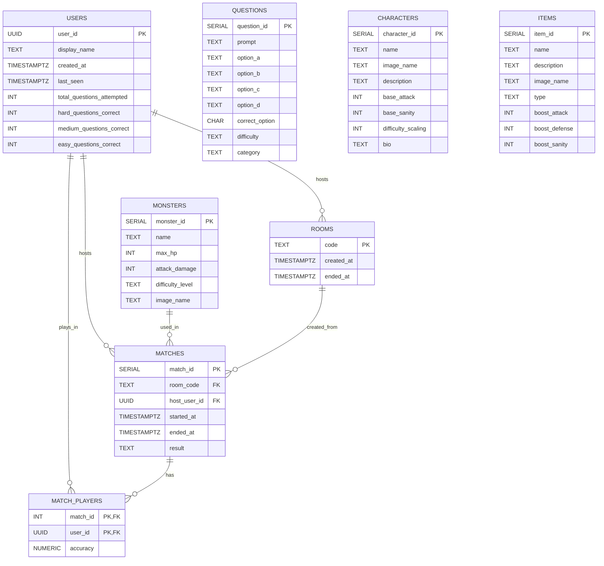

# Eldritch Game Backend

[Front End Live Demo](https://eldritch-game.netlify.app/)

[Front End Repo](https://github.com/Mdoughty-dev/Eldritch_Game)

## Intro

Eldritch is a multi-player horror-themed quiz-based video game. Built as a web-based application, it allows users to experience an immersive horror RPG combined with elements of a competitive quiz. Players must answer questions to fight eldritch monsters.

Each match lets a team of 1–4 players face a sequence of three monsters (three stages). Every stage is made up of many rounds where in every round the server sends a multiple-choice question to all players; correct answers damage the monster, while wrong or missing answers damage the shared team HP. Defeat all monsters before the team HP reaches zero to win.

The project was built with a decoupled architecture, using a Node.js game engine on the backend and Phaser on the frontend as a dedicated game-loop renderer. A key engineering decision was to keep Phaser focused on rendering and client-side interaction, while the backend retained authority over the actual game logic. The frontend sends player actions, such as joining a room or selecting an answer, but it does not calculate authoritative outcomes. Instead, it listens for server responses and re-renders accordingly.

This separation provides several advantages:

- **Consistency:** The same game rules apply across solo and multiplayer modes because the authoritative logic lives in one place.

- **Security:** Combat resolution and correct answers are not exposed directly in the client, reducing opportunities for manipulation.

- **Scalability:** Frontend scenes can evolve visually without requiring major rewrites of backend logic.

- **Maintainability:** Phaser handles the experiential layer, while Node.js and Socket.io handle synchronisation and state, keeping responsibilities cleanly separated.

## Local Installation

To run locally

### Create .env files

Create an .env file

```
PORT=3000
CLIENT_URL=http://localhost:5173
DATABASE_URL=postgresql://localhost/eldritch
PGDATABASE=eldritch
```

Create an env.development file

```
PGDATABASE=eldritch
```

### Install

```bash
npm install
npm run setup-dbs
npm run seed
npm run dev
```

If initialised succesfully, you will see the backend is accesible at `http://localhost:3000`

## Backend architecture

### Game Logic

The backend runs a quiz loop that supports 1–4 players per match and keeps the game state on the server. Each character has fixed stats (base_attack and base_sanity), and those values are used directly in the combat math so the UI and the underlying logic always match. Correct answers apply damage equal to base_attack, while wrong or missing answers add to a shared team damage pool derived from the monster’s attack_damage and the number of incorrect players, so both monster HP and incoming damage are scaled based on the number of players in the room. To keep pacing consistent between solo and multiplayer, monster HP and damage are calculated at runtime from per‑player base values and a pair of tuning constants (MONSTER_HP_ADJUSTMENT_FACTOR and MONSTER_DAMAGE_ADJUSTMENT_FACTOR), which makes it easy to adjust difficulty without changing the core rules or data model.

### Game lifecyle and relationship to frontend

1.  **Setup Phase**

- FE: A user opens the game, and either clicks a button to create a room or to join one, the inputted data is held in react memory.
- FE: A new screen then appears to choose a character, GET request to API to obtain list of available characters. Once selected a joinRoom event is emitted.
- BE: The server detects the `joinRoom` event and initialises the room object in memory and updates the users in memory as needed broadcasting everytime a `lobbyUpdated` event.
- FE: Users are moved to the lobby. At some point the host clicks on a start game button emitting the `StartGame` event.
- BE: The server detects the `startGame` event triggered by the host and loads initial data (the first monster and the questions) and hands control to the internal logic functions.

2.  **Battle Loop**

- BE: `startGame` (and subsquently `handleClientReady`) call the function `startNextRound.js`: increments roundNumber, sets the quiz timer, laods the question and emits to the room roundStarted with the current question.
- FE: the users are shown the question and and mutliple choices and the coundown timer. Once a user submits an answer they trigger the socket event `submitAnswer`.
- BE: The server detects `SubmitAnswer`, receives validates and saves answer. If all answers are received timer is ended early. Either way, the function `resolveRound.js` is then called.
- BE: `resolveRound.js` triggered by the timer expiring (in `StartNextRound`) or all answers being in. Calculates damage, updates HPs, and emits `roundResult` to the room. After emitting, it sets room.waitingForHostReady = true and does not call `startNextRound` directly. If a monster was defeated mid-game, the next monster and question set are also loaded from the DB here before `roundResult` is emitted.
- FE: Displays the round result screen — correct answer, HP changes, per-player results and any necessary animation. Once ready, the FE emits `clientReadyForNextRound`.
- BE: once it receives `clientReadyForNextRound`, it verifies the sender is the host, clears waitingForHostReady, and calls `startNextRound` — looping back to the top of this battle loop.

3.  **Resolution Phase**

- BE: resolveRound: if either monster HP or team HP are <= 0 then `gameEnded` event is broadcasted and final stats are saved to the database.
- FE: it listens for `gameEnded` when it reiceves it either shows a win screen or gameover screen.

### Disconnect / Reconnection Flow

The backend distinguishes between two types of player "leaving":

**Intentional leave** (`leaveRoom` event): The player is removed from the room immediately with no delay. If the room is now empty the room record is cleaned up from the database and deleted from memory. If host left, hostUserId is reassigned to the next player. `lobbyUpdated` is broadcast to remaining players.

**Unintentional disconnect** (e.g. tab closed, refresh, network blip): A 10-second grace period timer starts. The player is not removed from the room immediately, allowing them to reconnect. If they reconnect within 10 seconds the timer is cleared and their socketId is updated. If the game is in progress, `roundStarted` is emitted directly to their socket to fast-forward them back into the current round. If the grace period expires without reconnection the server checks the room state:

- Lobby: player is removed, host is reassigned if needed, lobbyUpdated is broadcast.

- In-game: `gameEnded` with reason: "player_disconnected" is broadcast to the room, match stats are saved to the database, and roomStatus is set to "ended".

#### Duplicate tab / second tab prevention

On joinRoom, the server checks whether the userId is already present in any room in memory. If the user is already in the same room their socketId is updated (treated as a reconnect). If they are in a different room a joinError is returned with code IN_DIFFERENT_ROOM, blocking them from joining until they leave or finish their existing game.

## Key Engineering Challenges & Solutions

**Room Code Generation (Optimistic Insertion)**

- **Problem:** Generating unique 6-character room codes requires checking if a code already exists. Querying the database first creates a time-of-check to time-of-use vulnerability and doubles the database load during concurrent room creation.
- **Solution:** The system utilizes an optimistic insertion pattern. The backend assumes the generated code is unique and attempts to insert it immediately. If PostgreSQL rejects the insertion due to a primary key constraint violation (error code `23505`), the server intercepts the specific error, generates a new code, and retries the insertion (up to 5 times). This natively handles concurrent requests and minimizes database queries.

**State Management and Database Load**

- **Problem:** Storing active multiplayer game state—such as team hit points, countdown timers, and submitted answers—in a PostgreSQL database introduces high latency and requires an unsustainable volume of read and write operations during the fast-paced gameplay loop.
- **Solution:** The backend implements an in-memory game state architecture. The active game data is held within a Node.js `rooms` object in RAM, enabling sub-second data updates and fast WebSocket broadcasting. The relational database is strictly reserved for static content retrieval (questions, monsters, characters) at the start of a match and for archiving the final match statistics when the game concludes.

**Connection Instability and Reconnections**

- **Problem:** Network instability or browser tab refreshes close the WebSocket connection. Automatically removing a player immediately upon disconnection disrupts the cooperative multiplayer session for the entire team.
- **Solution:** The system employs a delayed-removal disconnect process. When a WebSocket connection closes, the server initiates a 10-second timer. Players are identified by a stateless UUID stored in their browser's Local Storage. If the player reconnects and transmits their UUID before the timer expires, the server cancels the removal sequence, registers their new socket ID, and transmits the current round data to synchronize their client directly back into the live match.

**Security and Client-Side Manipulation**

- **Problem:** Transmitting the complete quiz dataset to the client application exposes the game to network manipulation, allowing users to inspect payloads to identify the correct answers before the timer expires.
- **Solution:** The Node.js server retains absolute authority over the game data. When a round starts, the server transmits only the question prompt and the available options to the connected clients. The correct answer and the array of upcoming questions remain securely inside the server's memory.

**Client-Side Animation Synchronization**

- **Problem:** If the backend server dispatches the subsequent question immediately after calculating the results of a round, the client application lacks the required time to display damage calculations, health bar reductions, and character animations.
- **Solution:** The system requires an explicit readiness signal to proceed. Following the calculation and broadcast of the `roundResult`, the backend sets a `waitingForHostReady` state and halts the progression of the match. The backend resumes operation and calls `startNextRound` only after it receives the `clientReadyForNextRound` WebSocket event from the host player's client. This implementation ensures the frontend application has the exact duration it needs to execute visual updates between rounds.

**Duplicate Session and Multi-Tab Prevention**

- **Problem:** Users opening the game in multiple browser tabs simultaneously can create duplicate socket connections tied to the same player identity, leading to race conditions, duplicate answer submissions, and a corrupted game state.
- **Solution:** The backend implements a strict session-validation check during the connection phase. When a user attempts to join a room, the server scans the active in-memory state. If the player's unique ID is already present and their existing WebSocket is actively connected (not in a temporary disconnection grace period), the server explicitly blocks the new connection attempt and issues an `ALREADY_IN_THIS_ROOM` socket error. This guarantees exactly one active socket per player identity.

**Single-Path Architecture for Solo and Multiplayer Modes**

- **Problem:** Developing separate state management and logic flows for single-player versus multiplayer modes increases code duplication, introduces mode-specific bugs, and complicates future feature development.
- **Solution:** The system employs a "Single-Path" architecture. Solo play is not treated as a distinct game mode; instead, a solo player is simply routed into a standard multiplayer lobby. The Node.js server processes all game events, timer countdowns, and HP calculations through the exact same WebSocket event pipeline and in-memory `rooms` object regardless of player count, ensuring absolute uniformity in game rules and reducing maintenance overhead.

**Deferred Database Persistence for Real-Time Performance**

- **Problem:** Executing database write operations (such as updating player accuracy, logging match history, and modifying user records) during the live battle loop introduces latency and disrupts the real-time WebSocket synchronization.
- **Solution:** The backend completely decouples real-time gameplay from persistent storage writes. During an active match, all state changes (damage dealt, answers submitted) are mutated exclusively within the fast in-memory RAM object. PostgreSQL `INSERT` and `UPDATE` queries are strictly deferred until the `gameEnded` event is triggered. At that exact moment, the final game state is aggregated and bulk-written to the database in a single resolution phase.

**Dynamic Host Migration and Privilege Management**

- **Problem:** Multiplayer sessions require a single authoritative client to trigger state transitions (like starting the game or advancing rounds) to prevent conflicting requests. However, assigning these privileges to a single user creates a single point of failure; if the host disconnects, the game session could stall permanently.
- **Solution:** The backend implements a dynamic host system. The user who creates the room is assigned the `hostUserId`. The frontend uses this ID to conditionally render control buttons, and the backend validates incoming progression events against this ID. If the current host disconnects and their reconnection timer expires, the server automatically executes a host migration. It reassigns the `hostUserId` to the next connected player in the room's roster and broadcasts the updated state to all clients, ensuring the match remains fully playable.

## Game Data Handling

The backend serves as the source of truth for the entire application. It combines an in-memory rooms map for live game state, a relational database for persistent cold data (questions, monsters, users, matches), and a small set of shared constants to control pacing and difficulty. Communication with clients uses a hybrid model: event-driven WebSockets for real-time gameplay, supported by targeted REST endpoints for static data retrieval

## Relational Database Architecture

A normalised schema handles long-term "Cold Data" and persistent records, ensuring a clear separation between content, user identity, and match results:

- **Game Content Library:** Tables for `QUESTIONS`, `MONSTERS`, and `CHARACTERS` act as a read-only source of truth, ensuring that game balance and content are decoupled from core server logic.

- **User Persistence:** The `USERS` table stores the unique identifiers required to link browser sessions to persistent player profiles. This will allow the implementation of user authentication at a later stage.

- **Match History:** Every session is recorded in a `MATCHES` table, while a junction table (`MATCH_PLAYERS`) captures granular per-player performance. Final results are archived via a REST pattern to ensure reliable persistence once the socket session ends.

- **Session Logging:** A `ROOMS` table records the lifecycle timestamps of each created lobby.

## DB schema



**USERS**
Stores every player who has ever joined a room, keyed by a persistent UUID, and keeps aggregate quiz stats and presence metadata. It is populated and refreshed via the joinRoom, submitAnswer, and disconnect socket flows so match history and leaderboard data can be tied back to a stable identity, and can later be extended to support full user authentication. last_seen is maintained via the saveUser upsert, which runs in three places: on joinRoom (first-time or returning players), on every submitAnswer during a match, and once more on socket disconnect. This keeps last_seen closely aligned with real player activity (answer submissions) while guaranteeing an accurate final timestamp at the moment they leave, without needing a separate heartbeat system. The display_name column always reflects the most recent name the player used when joining, so the leaderboard and match history show their latest chosen name rather than the original one.

**QUESTIONS**
Quiz content, seeded once, never written to during gameplay. On startGame and on each stage transition, the server reads from this table to pick QUESTIONS_PER_MONSTER questions for the current monster, based on its difficulty. Questions difficulty is "easy", "medium", "hard".

**MONSTERS**
Also static seed data. The server reads one row on startGame to get the monster's name and all other details. Monsters difficulty's level is "easy", "medium", "hard".

**CHARACTERS**
Static content. Not touched during game, it's here for when we add character picking before the lobby.

**ROOMS**
A record that a room existed. Written to when the host creates the room, and updated with started_at and ended_at as the game progresses. Useful for game history. N.B. the live game state lives in memory, not here.

**MATCHES**
The main record of a completed game, so we have a game history. Only written to at gameEnded. Links a room, a host, and a monster together with the outcome ("defeat", "victory", "abandoned").

**MATCH_PLAYERS**
Junction table. One row per player per match, storing their accuracy score. Written to at gameEnded alongside the MATCHES row. We have it so we can build a leaderboard.

## In-memory game state

To achieve sub-second response times, an in-memory game state system is used. By maintaining "live" data, such as HP, active timers, and room participants, within a server-side **`rooms` object in RAM**, the engine avoids the latency of constant database querying. This "Single-Path" architecture treats solo games and multiplayer rooms identically, ensuring logic remains uniform.

The server also acts as a secure gatekeeper. Sensitive data, such as correct answers and upcoming question IDs, are kept strictly hidden in memory. By only emitting the question text and options, the architecture prevents client-side cheating via network inspection.

### Questions in memory

When a game starts, the backend loads a batch of QUESTIONS_PER_MONSTER questions per monster (currently 50) from the QUESTIONS table based on the current stage difficulty. These questions are stored on the room object in the in-memory rooms map. The correct options never leave the backend; only the prompt and answer options are sent to clients, which prevents cheating via network inspection and means this number can be reduced later to make games shorter or harder.

```js
  const roomStatusExample = {
    code: 'ABCDEF', // string
    hostUserId: 'uuid-123', // string (UUID)
    roomStatus: 'in-game',  // 'lobby' | 'in-game' | 'ended'
    startedAt: 1710000000000, // timestamp ms | null
    players: [
      {
      userId: 'uuid-123',
      socketId: 'socket-1',
      name: 'Alice',
      correctAnswers: 5,
      totalQuestions: 10,
      hardCorrectAnswers: 5,
      mediumCorrectAnswers: 0,
      easyCorrectAnswers: 0,
      character: {
        id: 1,
        name: 'The Scholar',
        image: 'character1.png',
        description: 'A seeker of forbidden knowledge.',
        base_attack: 5,
        base_sanity: 150,
        difficulty_scaling: 1,
        bio: 'I'm 82 and I am very wise'
      }
    }
    ],
    currentStage: 1, // 1 | 2 | 3
    roundNumber: 1, // nth round across the whole game session
    maxTeamHp: 150,
    teamHp: 150,
    monster: {
      id: 1,
      name: 'Skeleton Knight',
      max_hp: 80,
      attack_damage: 10,
      image_url: '',
      difficulty_level: 'easy'
    },
    monsterHp: 80,
    questions: [
      {
        question_id: 10,
        prompt: 'Binary of decimal 2?',
        option_a: '10',
        option_b: '11',
        option_c: '01',
        option_d: '00',
        correct_option: 'a',
        difficulty: 'medium',
        category: 'tech',
      }
      // ...
    ],
    questionIds: [10, 25, 7, 3, 19],
    currentQuestionIndex: 0,
    currentQuestionId: 10,
    roundDeadline: Date.now() + 15000,
    timerId: {Timeout object}, // quiz countdown timer
    answers: {
      'uuid-123': null
    },
    disconnectTimers: {'uuid-123': {Timeout object}, /* ... */
    }, // holds per-plyaer timeout details for the grace period reconnection logic
    waitingForHostReady: true, //boolean  set to true in resolveRound after a round ends. Used to wait to fire startNextRound until the front end sends clientReadyForNextRound.
  };

  const rooms = { ABCD: roomStatusExample };
```

## Constants

| Constant                         | Value  | Purpose                                                                                                  |
| -------------------------------- | ------ | -------------------------------------------------------------------------------------------------------- |
| MAX_PLAYERS                      | 4      | Max players per room                                                                                     |
| MIN_PLAYERS                      | 1      | Min to start a game                                                                                      |
| TOTAL_STAGES                     | 3      | Number of monsters                                                                                       |
| QUESTIONS_PER_MONSTER            | 50     | Questions loaded per stage; set to 50 to avoid running out mid-fight, can be reduced to tweak difficulty |
| ROUND_DURATION_MS                | 15000  | Round timer (ms)                                                                                         |
| DISCONNECT_GRACE_PERIOD_MS       | 10000  | Reconnection window (ms)                                                                                 |
| ROOM_CLEANUP_DELAY_MS            | 180000 | Memory cleanup delay after game ends (ms)                                                                |
| MONSTER_DAMAGE_ADJUSTMENT_FACTOR | 1      | Scales monster damage per extra player                                                                   |

## The Hybrid API Approach

Rather than forcing all communication through one protocol, the architecture is split based on the player's journey:

- **Stateless REST Retrieval:** A standard endpoint (`GET /api/characters`) is utilised for the character selection screen. At this stage, players have not yet joined a room, making a persistent connection unnecessary. Using REST here is the most logical choice and prevents overhead before the main game loop begins. GET leaderboard: This because leaderboard results are stored in the DB across games.

- **Stateful Socket Engine:** Once a player joins a lobby, the system transitions to **Socket.io**. This leverages the speed and synchronisation features of WebSockets. This persistent connection is essential for "Hot Data", the sub-second updates for health bars, timers, and combat results that must be pushed to all clients simultaneously.

### REST API Endpoints

#### GET /api/characters

**Description**: Fetches the static list of available characters for the frontend selection screen before a socket connection is established.

**Query Parameters**: None

**Response**: 200 OK

```json
[
  {
    "id": 1,
    "name": "The Scholar",
    "image_name": "character1.png",
    "description": "A seeker of forbidden knowledge.",
    "base_attack": 5,
    "base_sanity": 150,
    "difficulty_scaling": 1,
    "backstory": "I'm 82 and I am very wise"
  }
]
```

#### GET /api/leaderboard

**Description**: [placeholder]

**Query Parameters**: None

**Response**: 200 OK

```json
[
  {
    "display_name": "Bob",
    "created_at": "2025-01-01T12:00:00Z",
    "last_seen": "2025-01-10T18:30:00Z",
    "total_questions_attempted": 62,
    "easy_questions_correct": 5,
    "medium_questions_correct": 5,
    "difficult_questions_correct": 5
  }
  // ...
]
```

#### GET /ping

**Description**: A minimal public REST endpoint used to maintain infrastructure uptime. An external scheduling service executes a GET request to this route every five minutes. This continuous network activity prevents the Render web service from suspending the Node.js process and prevents the Supabase PostgreSQL database from pausing, ensuring the server is instantly available when users attempt to play.

**Query Parameters**: None

**Response**: 200 OK

### Persistent Identity (UUID + Local Storage)

To avoid the friction of a sign-up flow, a stateless identity strategy is used. Unique IDs are generated via the **Web Crypto API** (`crypto.randomUUID()`) and stored in **Local Storage**. This allows the backend to recognise returning players, supporting seamless reconnection to active rooms and long-term stat tracking without needing a full authentication server.

## Sockets : event schema

#### joinRoom

**direction**: client to server
**trigger**: user confirms character selection (Final step of the Join/Create flow).

**payload**:

```
{
name: "string",
roomCode: "string or empty"
userId: "UUID",
characterId: 1
}
```

**server side effects**:

- Update/add user in USERS table by UUID.
- If no roomCode: generate code, add row to ROOMS with created_at.
- If roomCode given: check room exists and is lobby status.
- Add to rooms[code] memory object: roomStatus "lobby", players array, hostUserId if needed.
- Socket joins the room.

**Emits in response**:

- Success (to room): lobbyUpdated with roomCode, hostUserId, players[], roomStatus.
- Error (to client): joinError with {message, code: "ROOM_NOT_FOUND" | "ROOM_FULL" | etc}.

---

#### lobbyUpdated

**direction**: server to client
**trigger**: after joinRoom, disconnect, or host change.

**payload**:

```
{
roomCode: "string",
hostUserId: "string",
players: [{userId, name, character}],
roomStatus: "lobby" | "in-game" | "ended"
}
```

**Sent to**: All in room.

**effects in front end**:

- Show Lobby screen.
- Update players list.
- Host sees Start button.

---

#### leaveRoom

**direction**: client to server
**payload**: none
**server side effects**:

- Removes player from rooms[code].players.
- Socket leaves the room
- If room is empty: marks room as ended in DB and deletes from memory
- If host has left: reassigns hostUserId to the next player in the array
- Sends lobbyUpdated to remaining players
- emits in response: lobbyUpdated to room, or nothing if room was deleted

---

#### requestLobby

**direction**: client to server
**payload**: none
emits in response:

- Success: lobbyUpdated with roomCode, hostUserId, players, roomStatus.
- Error: lobbyError with message and code NO_ROOM | ROOM_NOT_FOUND.

---

#### startGame

**direction**: client to server
**trigger**: host clicks Start.

**payload**: none — roomCode and userId are read server-side from socket.data.

**server side effects**:

- Check: room exists, caller is host, status lobby, 1+ players.
- Load monster, questions.
- Set rooms[code]: status "in-game", teamHp, monsterHp, questionIds[], currentQuestionIndex 0, answers map empty.
- Call internal startNextRound() function.

**Emits in response**:

- Success: roundStarted to room.
- Error: startError {message, code: "NOT_HOST" | etc}.

---

#### roundStarted

**direction**: server to client
**trigger**: after startGame or roundResult.

**payload**:

```
{
monster: {
name: "string",
hp: number,
maxHp: number,
image: "string"
},
question: {
id: 3,
prompt: "string",
options: { a, b, c, d }
},
gameState: {
teamHp: number,
roundNumber: number,
roundDeadline: number
}
}
```

**Sent to**: All in room.

**effects in front end**:

- Show Battle screen.
- Display question + buttons.
- Start countdown.

---

#### submitAnswer

**direction**: client to server
**trigger**: player clicks answer.

**payload**:

```
{ questionId, answer: "a|b|c|d" }
```

**server side effects**:

- Check room in-game, question matches, before deadline.
- Save answer in rooms[code].answers[userId] if not set.
- When all answered or timeout:
  - Calc per-player correct, team/monster damage.
  - Update HPs.
  - If monsterHp <=0 → victory.
  - If teamHp <=0 → defeat.
  - Else next roundStarted.

**Emits in response**:

- Error: answerError
- Success: triggers internal round resolution function (resolveRound.js) which subsequently emits roundResult or gameEnded to the room.

---

#### roundResult

**direction**: server to client
**trigger**: round resolved.

**payload**:

```
{
"roundNumber": 1,
"questionId": 10,
"correctOption": "c",
"playerResults": [
{
"userId": "uuid-123",
"name": "Alice",
"answer": "c",
"isCorrect": true,
"correctAnswers": 5,
"totalQuestions": 10
}, {player2}, etc.
],
"teamDamageTaken": 10,
"monsterDamageTaken": 15,
"teamHpAfter": 140,
"monsterHpAfter": 65,
"isFinalRound": false,

//The following fields are ONLY included if the monster was defeated and the team is moving to next round
"isNextStage": true,
"nextStage": 2,
"nextMonster": {
"monster_id": 2,
"name": "Crypt Warden",
"max_hp": 120,
"attack_damage": 15,
"image_name": "",
"difficulty_level": "medium"
}
}
```

**Sent to**: All in room.

**effects in front end**:

- Update HP: Animate the health bars for both the team and the monster.

optional:

- Show results: Display the correct answer and highlight who got it right/wrong.
- Refresh Stats: Update the "Live Accuracy" display for each player using correctAnswers and totalQuestions.
- Wait: Display the results for a few seconds before the next roundStarted event arrives.

---

#### clientReadyForNextRound

**direction**: client to server
**trigger**: the host player signals readiness to proceed after seeing a roundResult, specifically after each round result display and after a stage transition (isNextStage: true).
**payload**: none, roomCode and userId are read from socket.data.
**server side effects**:

- Check room.waitingForHostReady is true.
- Unset the flag.
- Call startNextRound(io, code).
- Emits in response: roundStarted to the room (via startNextRound).

---

#### gameEnded

**direction**: server to client
**trigger**: HP hits 0, players run out of questions, or a player disconnects.

**payload**:

```
{
"result": "defeat", // or "victory" or "abandoned"
"reason": "player_disconnected", // or "monster_defeated" or "out_of_questions" or "team_hp_zero" or "server_error"
"monsterId": 1,
"teamHpFinal": 0,
"monsterHpFinal": 45,
"perPlayerAccuracy": [
{
"userId": "uuid-123",
"name": "Alice",
"accuracy": 50,
"correctAnswers": 5,
"totalQuestions": 10
}
]
}
```

**server side effects**:

- Save MATCHES row: ended_at, result, etc.
- Save MATCH_PLAYERS with accuracy.
- Set roomStatus "ended".

**effects in front end**:

- Go to Victory/Game Over screen.
- Show final stats.

---

### Error Codes

#### joinRoom errors

Event: `joinError` (server to client)

- `NO_NAME` – `"Name is required"`
- `NO_USER` – `"User is required"`
- `ROOM_NOT_FOUND` – `"Room not found"`
- `NO_CHARACTER` - `"Character selection is required"`
- `INVALID_CHARACTER` – `"Invalid character selected"`
- `ROOM_IN_GAME` – `"Game already started"`
- `ROOM_ENDED` – `"Game has already ended"`
- `ROOM_FULL` – `"Room is full"`
- `SERVER_ERROR` - `"A server error occurred"`
- `ALREADY_IN_THIS_ROOM` - `You are already in this room.`
- `IN_DIFFERENT_ROOM` - `You are already playing in room [room code]. Please finish or leave that game first.`

Payload format:

```js
{
  message: string,
  code: 'NO_NAME' |'NO_USER' | `NO_CHARACTER` | 'ROOM_NOT_FOUND' | 'ROOM_IN_GAME' | 'ROOM_ENDED' | 'ROOM_FULL` | 'SERVER_ERROR'
}
```

Payload: `{ message: string, code: 'NOROOM' | 'ROOMNOTFOUND' }`

#### lobbyError

Event: `lobbyError` (server → client)

- `NO_ROOM` — `You are not in a room`
- `ROOM_NOT_FOUND` — `Room not found`

#### startGame errors

Event: `startError` (server to client)

- `NOT_HOST` – `"Only the host can start the game"`
- `WRONG_STATUS` – `"Room is not in lobby state"`
- `NOT_ENOUGH_PLAYERS` – `"At least x players are required to start"`

Payload:

```js
{
  message: string,
  code: 'NOT_HOST' | 'WRONG_STATUS' | 'NOT_ENOUGH_PLAYERS'
}
```

#### submitAnswer errors

Event: `answerError` (server to client)

`WRONG_STATUS` – `"Room is not in-game"`
`DEADLINE_PASSED` – `"The answer deadline has passed"`
`WRONG_QUESTION` – `"Question ID does not match current round"`
`ALREADY_ANSWERED` – `"You have already submitted an answer this round"`

Payload:

```js
{
  message: string,
  code: 'WRONG_STATUS' | 'DEADLINE_PASSED' | 'WRONG_QUESTION' | 'ALREADY_ANSWERED'
}
```

## Internal Game Logic Functions

#### startNextRound(io, code)

This function handles the preparation and delivery of a new question to the room. Increments roundNumber and currentQuestionIndex, loads the current question from the room's questions array, calculates the roundDeadline timestamp, and stores a setTimeout reference in room.timerId that will call resolveRound automatically when the 15 seconds expire. Once the timer is set, it broadcasts roundStarted payload to all players in the room. This function is called by handleStartGame for the first question, and by handleClientReady for all subsequent questions.

#### resolveRound(io, code)

This function calculatess the outcome of the player submissions. It clears the round timer, then compares each player's submitted answer against the correct option. Correct answers deal damage to the monster; incorrect or missing answers deal damage to the team. After updating both HPs it evaluates three possible outcomes:

- Game over — team HP is zero or questions are exhausted: emits roundResult followed immediately by gameEnded, saves the match to the database, and sets roomStatus to "ended".

- Stage complete (monster defeated) — monster HP is zero but it is not the final stage: fetches the next monster and a fresh question set from the database, resets currentQuestionIndex to -1, then emits roundResult with isNextStage: true and the next monster data.

- Round complete — game is still active: resets the answers map and emits roundResult.

In outcomes 2 and 3, after emitting roundResult the function sets room.waitingForHostReady = true and returns — it does not call startNextRound directly. The game loop resumes only when the host emits clientReadyForNextRound. This is to allow the front end any time it needs to play animations inbetween questions.
