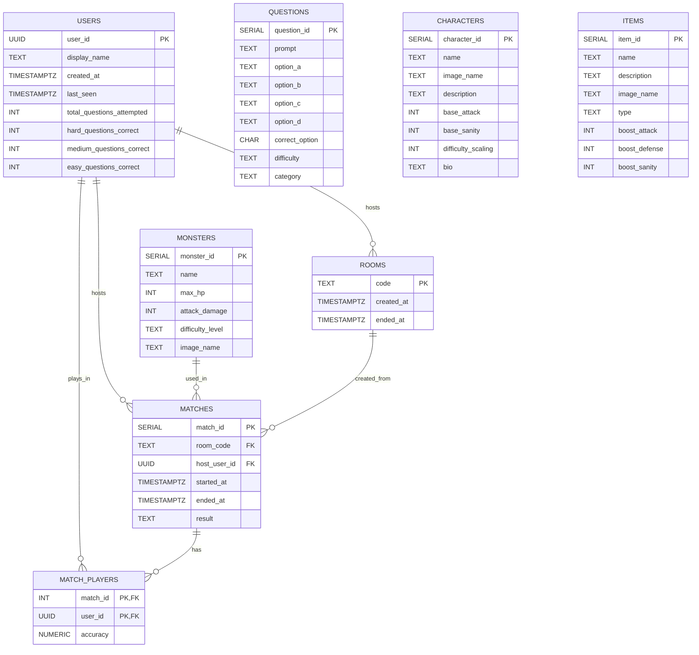

# Eldritch Backend Specification

## DB schema



USERS
Stores every player who has ever joined a room. Gets written to on socket joinRoom. Mainly exists so we can tie match history and accuracy stats back to the UUID and so that later on once we add user authentication we already have a user table.

QUESTIONS
Quiz content, seeded once, never written to during gameplay. The server reads from this on startGame to pick a set of questions for the match. Questions difficulty is "easy", "medium", "hard".

MONSTERS
Also static seed data. The server reads one row on startGame to get the monster's name and all other details. Monsters difficulty's level is "easy", "medium", "hard".

CHARACTERS
Static content. Not touched during game, it's here for when we add character picking before the lobby.

ROOMS
A record that a room existed. Written to when the host creates the room, and updated with started_at and ended_at as the game progresses. Useful for game history. N.B. the live game state lives in memory, not here.

MATCHES
The main record of a completed game, so we have a game history. Only written to at gameEnded. Links a room, a host, and a monster together with the outcome ("defeat", "victory", "abandoned").

MATCH_PLAYERS
Junction table. One row per player per match, storing their accuracy score. Written to at gameEnded alongside the MATCHES row. We have it so we can build a leaderboard.

## In-memory game state

```js
  const roomStatusExample = {
    code: 'ABCD',
    hostUserId: 'uuid-123',
    roomStatus: 'in-game', // or "lobby" or "ended"
    startedAt: timestap,
    players: [
      {
      userId: 'uuid-123',
      socketId: 'socket-1',
      name: 'Alice',
      correctAnswers: 5,
      totalQuestions: 10,
      character: {
        id: 1,
        name: 'The Scholar',
        image: 'character1.png',
        description: 'A seeker of forbidden knowledge.',
        base_attack: 5,
        base_sanity: 150,
        difficulty_scaling: 1,
        backstory: 'I'm 82 and I am very wise'
      }
    }
    ],
    currentStage: 1, // 1/2/3
    roundNumber: 1, // nth round across the whole game session
    maxTeamHp: 150,
    teamHp: 150,
    monster: {
      id: 1,
      name: 'Skeleton Knight',
      max_hp: 80,
      attack_damage: 10,
      image_url: '',
      difficulty_level: 'easy'
    },
    monsterHp: 80,
    questions: [
      {
        question_id: 10,
        prompt: 'Binary of decimal 2?',
        option_a: '10',
        option_b: '11',
        option_c: '01',
        option_d: '00',
        correct_option: 'a',
        difficulty: 'medium',
        category: 'tech',
      }
      // ... of course more questions here
    ],
    questionIds: [10, 25, 7, 3, 19],
    currentQuestionIndex: 0,
    currentQuestionId: 10,
    roundDeadline: Date.now() + 15000,
    timerId: {Timeout object},
    answers: {
      'uuid-123': null
    },
  };

  const rooms = { ABCD: roomStatusExample };
```

## Game lifecyle

1.  Setup Phase

- FE: A user opens the game, and either clicks a button to create a room or to join one, the inputted data is held in react memory.
- FE: A new screen then appears to choose a character, GET request to API to obtain list of available characters. Once selected a joinRoom event is emitted.
- BE: The server detects the joinRoom event and initialises the room object in memory and updates the users in memory as needed broadcasting everytime a lobbyUpdated event.
- FE: Users are moved to the lobby. At some point the host clicks on a start game button emitting the StartGame event.
- BE: The server detects the startGame event triggered by the host and loads initial data (the first monster and the questions) and hands control to the internal logic functions.

2.  Battle Loop

- BE startNextRound.js: this is called by startGame. Sets the 15s timer, laods the question and emits roundStarted with the current question.
- FE: the users are shown first question and and mutliple choices and timer. Once a user submits an answer they trigger the custom event "submitAnswer"
- BE: The server detects the event SubmitAnswer, receive and save answer. If all answers are received timer is ended early. It calls resolveRound.js function
- BE: resolveRound triggered by the timer expiring (in StartNextRound) OR all answers being in. It calculates damage and updates HPs. If monsters are not defeated and team HP > 0 calls startNextRound and battle loop continues. Once the first monster is defeated, it loads the new one.

3.  Resolution Phase

- BE: resolveRound: on the other hand if either monster HP or team HP are <= 0 then gameEnded event is broadcasted and final stats are saved to the database.
- FE: it lsitens for gameEnded when it reiceves it either shows a win screen or gameover screen.

## Imporntant considerations

- No need for API endpoints other than GET characters. This because chracters objects are stating and are fetched before the game starts. Once the game stars web sockets are much more suitable.
- No need for OOP, at least initially, just plain objects.
- The name/code entry and character selection happens locally in react, only once both are completed joinRoom is emitted by the client with the full payload (name, userId, roomCode, characterId). This prevents "partial" players in the backend rooms state. If they're in the array, they're fully initialized.

## REST API Endpoints

### GET /api/characters

**Description**: Fetches the static list of available characters for the frontend selection screen before a socket connection is established.

**Query Parameters**: None

**Response**: 200 OK

```json
[
  {
    "id": 1,
    "name": "The Scholar",
    "image_name": "character1.png",
    "description": "A seeker of forbidden knowledge.",
    "base_attack": 5,
    "base_sanity": 150,
    "difficulty_scaling": 1,
    "backstory": "I'm 82 and I am very wise"
  }
]
```

## Sockets : event schema

### joinRoom

**direction**: client to server  
**trigger**: user confirms character selection (Final step of the Join/Create flow).

**payload**:

```
{
  name: "string",
  roomCode: "string or empty"
  userId: "UUID",
  characterId: 1
}
```

**server side effects**:

- Update/add user in USERS table by UUID.
- If no roomCode: generate code, add row to ROOMS with created_at.
- If roomCode given: check room exists and is lobby status.
- Add to rooms[code] memory object: roomStatus "lobby", players array, hostUserId if needed.
- Socket joins the room.

**Emits in response**:

- Success (to room): lobbyUpdated with roomCode, hostUserId, players[], roomStatus.
- Error (to client): joinError with {message, code: "ROOM_NOT_FOUND" | "ROOM_FULL" | etc}.

---

### lobbyUpdated

**direction**: server to client  
**trigger**: after joinRoom, disconnect, or host change.

**payload**:

```
{
  roomCode: "string",
  hostUserId: "string",
  players: [{userId, name, character}],
  roomStatus: "lobby" | "in-game" | "ended"
}
```

**Sent to**: All in room.

**effects in front end**:

- Show Lobby screen.
- Update players list.
- Host sees Start button.

---

### leaveRoom

**direction**: client → server  
**payload**: none
**server side effects**:

- Removes player from rooms[code].players.
- Socket leaves the room
- If room is empty: marks room as ended in DB and deletes from memory
- If host has left: reassigns hostUserId to the next player in the array
- Sends lobbyUpdated to remaining players
- emits in response: lobbyUpdated to room, or nothing if room was deleted

---

### requestLobby

**direction**: client → server  
**payload**: none
emits in response:

- Success: lobbyUpdated with roomCode, hostUserId, players, roomStatus.
- Error: lobbyError with message and code NO_ROOM | ROOM_NOT_FOUND.

---

### startGame

**direction**: client to server  
**trigger**: host clicks Start.

**payload**: none — roomCode and userId are read server-side from socket.data.

**server side effects**:

- Check: room exists, caller is host, status lobby, 1+ players.
- Load monster, questions.
- Set rooms[code]: status "in-game", teamHp, monsterHp, questionIds[], currentQuestionIndex 0, answers map empty.
- Call internal startNextRound() function.

**Emits in response**:

- Success: roundStarted to room.
- Error: startError {message, code: "NOT_HOST" | etc}.

---

### roundStarted

**direction**: server to client  
**trigger**: after startGame or roundResult.

**payload**:

```
{
  monster: {
    name: "string",
    hp: number,
    maxHp: number,
    image: "string"
  },
  question: {
    id: 3,
    prompt: "string",
    options: { a, b, c, d }
  },
  gameState: {
    teamHp: number,
    roundNumber: number,
    roundDeadline: number
  }
}
```

**Sent to**: All in room.

**effects in front end**:

- Show Battle screen.
- Display question + buttons.
- Start countdown.

---

### submitAnswer

**direction**: client to server  
**trigger**: player clicks answer.

**payload**:

```
{ questionId, answer: "a|b|c|d" }
```

**server side effects**:

- Check room in-game, question matches, before deadline.
- Save answer in rooms[code].answers[userId] if not set.
- When all answered or timeout:
  - Calc per-player correct, team/monster damage.
  - Update HPs.
  - If monsterHp <=0 → victory.
  - If teamHp <=0 → defeat.
  - Else next roundStarted.

**Emits in response**:

- Error: answerError
- Success: triggers internal round resolution function (resolveRound.js) which subsequently emits roundResult or gameEnded to the room.

---

### roundResult

**direction**: server to client  
**trigger**: round resolved.

**payload**:

```
{
  "roundNumber": 1,
  "questionId": 10,
  "correctOption": "c",
  "playerResults": [
    {
      "userId": "uuid-123",
      "name": "Alice",
      "answer": "c",
      "isCorrect": true,
      "correctAnswers": 5,
      "totalQuestions": 10
    }, {player2}, etc.
  ],
  "teamDamageTaken": 10,
  "monsterDamageTaken": 15,
  "teamHpAfter": 140,
  "monsterHpAfter": 65,
  "isFinalRound": false,

//The following fields are ONLY included if the monster was defeated and the team is moving to next round
"isNextStage": true,
  "nextStage": 2,
  "nextMonster": {
    "monster_id": 2,
    "name": "Crypt Warden",
    "max_hp": 120,
    "attack_damage": 15,
    "image_name": "",
    "difficulty_level": "medium"
  }
}
```

**Sent to**: All in room.

**effects in front end**:

- Update HP: Animate the health bars for both the team and the monster.

optional:

- Show results: Display the correct answer and highlight who got it right/wrong.
- Refresh Stats: Update the "Live Accuracy" display for each player using correctAnswers and totalQuestions.
- Wait: Display the results for a few seconds before the next roundStarted event arrives.

---

### gameEnded

**direction**: server to client  
**trigger**: HP hits 0, players run out of questions, or a player disconnects.

**payload**:

```
{
  "result": "defeat", // or "victory" or "abandoned"
  "reason": "player_disconnected", // or "monster_defeated" or "out_of_questions" or "team_hp_zero" or "server_error"
  "monsterId": 1,
  "teamHpFinal": 0,
  "monsterHpFinal": 45,
  "perPlayerAccuracy": [
    {
      "userId": "uuid-123",
      "name": "Alice",
      "accuracy": 50,
      "correctAnswers": 5,
      "totalQuestions": 10
    }
  ]
}
```

**server side effects**:

- Save MATCHES row: ended_at, result, etc.
- Save MATCH_PLAYERS with accuracy.
- Set roomStatus "ended".

**effects in front end**:

- Go to Victory/Game Over screen.
- Show final stats.

---

## Error Codes

### joinRoom errors

Event: `joinError` (server to client)

- `NO_NAME` – `"Name is required"`
- `NO_USER` – `"User is required"`
- `ROOM_NOT_FOUND` – `"Room not found"`
- `NO_CHARACTER` - `"Character selection is required"`
- `INVALID_CHARACTER` – `"Invalid character selected"`
- `ROOM_IN_GAME` – `"Game already started"`
- `ROOM_ENDED` – `"Game has already ended"`
- `ROOM_FULL` – `"Room is full"`
- `SERVER_ERROR` - `"A server error occurred"`
- `ALREADY_IN_THIS_ROOM` - `You are already in this room.`
- `IN_DIFFERENT_ROOM` - `You are already playing in room [room code]. Please finish or leave that game first.`

Payload format:

```js
{
  message: string,
  code: 'NO_NAME' |'NO_USER' | `NO_CHARACTER` | 'ROOM_NOT_FOUND' | 'ROOM_IN_GAME' | 'ROOM_ENDED' | 'ROOM_FULL` | 'SERVER_ERROR'
}
```

Payload: `{ message: string, code: 'NOROOM' | 'ROOMNOTFOUND' }`

### lobbyError

Event: `lobbyError` (server → client)

- `NO_ROOM` — `You are not in a room`
- `ROOM_NOT_FOUND` — `Room not found`

### startGame errors

Event: `startError` (server to client)

- `NOT_HOST` – `"Only the host can start the game"`
- `WRONG_STATUS` – `"Room is not in lobby state"`
- `NOT_ENOUGH_PLAYERS` – `"At least x players are required to start"`

Payload:

```js
{
  message: string,
  code: 'NOT_HOST' | 'WRONG_STATUS' | 'NOT_ENOUGH_PLAYERS'
}
```

### submitAnswer errors

Event: `answerError` (server to client)

`WRONG_STATUS` – `"Room is not in-game"`
`DEADLINE_PASSED` – `"The answer deadline has passed"`
`WRONG_QUESTION` – `"Question ID does not match current round"`
`ALREADY_ANSWERED` – `"You have already submitted an answer this round"`

Payload:

```js
{
  message: string,
  code: 'WRONG_STATUS' | 'DEADLINE_PASSED' | 'WRONG_QUESTION' | 'ALREADY_ANSWERED'
}
```

## Internal Game Logic Functions

### startNextRound(io, code)

This function handles the preparation and delivery of a new question to the room. It reads the current question data from the room's object, calculates the deadline timestamp, and starts the setTimeout timer that will force the round to end if players do not answer. Once the timer is set, it broadcasts roundStarted payload to all players in the room. This function is called by handleStartGame for the first question, and then by resolveRound for all subsequent questions.

### resolveRound(io, code)

This function calculatess the outcome of the player submissions. It clears the round timer, compares each player's submitted answer against the correct option, and deducts health points from the monster for correct answers or from the team for incorrect and missing answers. After updating the HPs, it checks win and loss . If team HP reaches zero or the final monster is defeated, it emits gameEnded . If the game is still active, it emits roundResult and then calls startNextRound to continue the game loop. If the monster's HP reaches zero but it is not the final stage, this function fetches the next monster and set of questions from the database, update the room state, and then calls internal function startNextRound.
