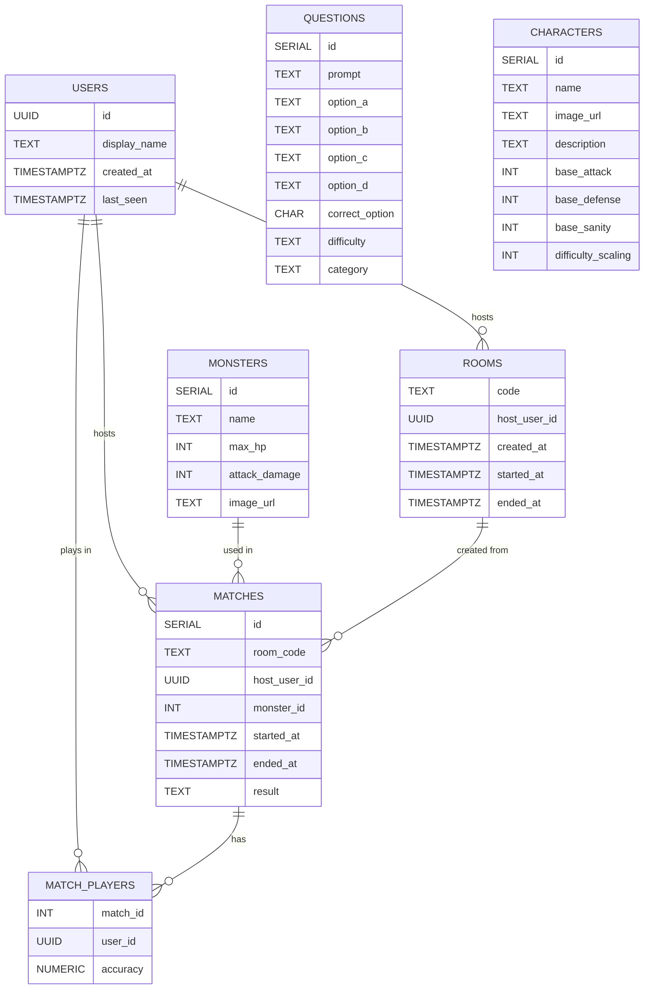

# Eldritch-Backend Initial Draft

## DB schema



## In-memory game state

```js
function roomExample() {
  const roomStatusExample = {
    code: 'ABCD',
    hostUserId: 'uuid-123',
    roomStatus: 'lobby', // or "in-game" or "ended"
    players: [
      { userId: 'uuid-123', socketId: 'socket-1', name: 'Alice' },
      { userId: 'uuid-456', socketId: 'socket-2', name: 'Bob' },
    ],
    teamHp: 100,
    monsterHp: 80,
    monsterId: 1,
    questionIds: [10, 25, 7, 3, 19],
    currentQuestionIndex: 0,
    currentQuestionId: 10,
    roundDeadline: Date.now() + 15000,
    answers: {
      'uuid-123': null,
      'uuid-456': null,
    },
  };

  // Globaltore for all active rooms
  const rooms = { ABCD: roomStatusExample };
}
```

## Imporntant considerations

- No need for API endpoints at least initially
- No need for OOP, at least initially, just plain objects.

## Sockets : custom events we will probably need

**joinRoom** (client to server)
When: user enters name + code (or creates a new room).

- The server updates the user table using UIID
- Generates a new room code if needed
- Updates room table
- Server creates/updates the in‑memory rooms[code]
- matches table is untouched as it's only used for finished games

**lobbyUpdated** (server to client)
When: either after joinRoom or when someone disconnects

- Server sends out latest lobby state for that room
- frontened updates players list

**startGame** (client to server)

- When? Host clicks “Start” in the lobby.
- Server loads monster, a fixed set of questions
- server initial match state (team HP, mosnter HP , questionIDs, currentQuestion, etc)
- Triggers roundStarted

**roundStarted** (server to client)
when: at the beginnong of every round

- server sends current question data front ends shows question and starts countdown

**submitAnswer** (client to Server)
when:player clicks an answer button on Battle screen.

- the server saves the answer in memory
- When all players have answered, or the round timer expires, server resolves the round.

**roundResult** (server to client)
When: after all players answer all rounds questions

- check correct options
- calculate player correcntess
- calculate damage

Front end shows:
Correct answers
Who was right/wrong?
Updated HP bars.

**gameEnded** (server to client)
when? when monster is deafted

- saves match in DB and save accuracy per user per match
- Frontend navigates to Game Over screen.
